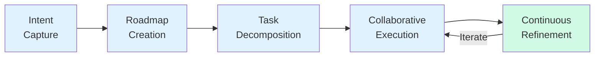
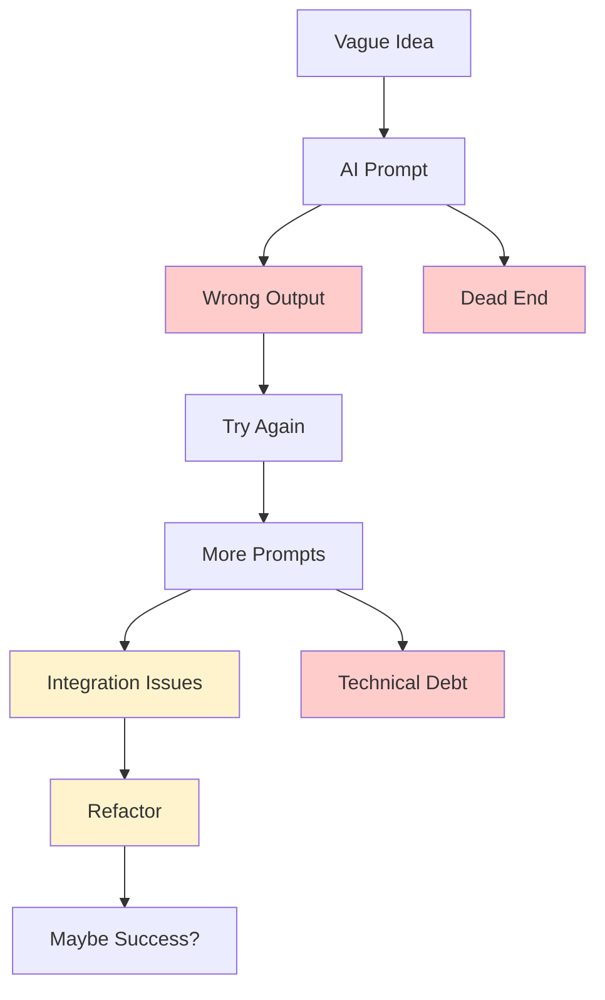
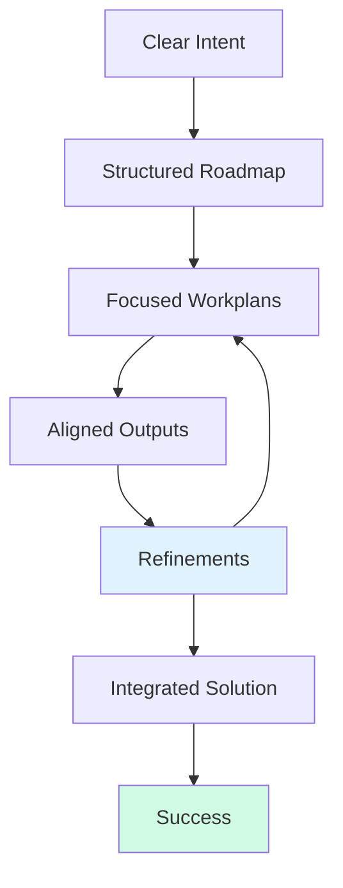

# Specflow is structure for building with software agents

[](https://www.specflow.com)
[](LICENSE)
[](https://github.com/specstoryai/specflow)

> "Plan first, act second. Every great building starts with a blueprint. Every successful software project starts with a plan."

## 🚀 What is Specflow?

Specflow is a **structured but flexible process methodology** for building software with AI SWE agents. It transforms the often chaotic process of agent-first development into a systematic, repeatable methodology that consistently delivers results aligned with your vision.

### The Problem

Building software with AI agents today often results in:
- 🎯 **Intent Gap** - What you envision vs. what AI produces
- 💭 **Context Loss** - AI forgets where you are between prompts
- 🧩 **Coordination Chaos** - Fragmented, incompatible outputs
- ⚡ **Efficiency Paradox** - Fast generation, extensive rework

### The Solution

Specflow provides structure through five interconnected phases:



## 📖 The Five Phases

### 1. Intent - Define Your Goal
**What & Why** - Start with clarity about what you're building and why it matters.

### 2. Roadmap - Plan Your Phases  
**Milestones** - Break your vision into manageable phases with clear goals.

### 3. Tasks - Break It Down
**Human + AI** - Convert roadmap items into specific tasks, optimally distributed.

### 4. Execute - Build Together
**Systematic** - Work through tasks methodically with your AI partner.

### 5. Refine - Iterate & Learn
**Improve** - Review outputs against intent and continuously improve.

## 🎯 Who Benefits?

- **👩‍💻 Software Developers** - Build features faster while maintaining quality
- **📊 Product Managers** - Bridge vision and execution effectively
- **🚀 Technical Leaders** - Scale team capacity with AI assistance
- **🤖 AI Enthusiasts** - Master structured prompting techniques

## 🌟 Why Specflow?

<table>
<tr>
<th align="center">Without Structure: Chaos</th>
<th align="center">With Specflow: Clarity</th>
</tr>
<tr>
<td width="50%">



</td>
<td width="50%">



</td>
</tr>
</table>

## 🚀 Getting Started

1. **Visit the website**: [www.specflow.com](https://www.specflow.com)
2. **Read the guide**: Start with our [Getting Started Guide](https://www.specflow.com/getting-started.html)
3. **Learn by example**: Explore [Project Examples](https://www.specflow.com/examples/)
4. **Watch tutorials**: Check out our [Video Library](https://www.specflow.com/videos.html)

## 📚 This Repository

This repository contains the source code for the Specflow methodology website:

```
specflow/
├── website/          # Quarto-based documentation site
│   ├── *.qmd        # Content pages (Quarto Markdown)
│   ├── assets/      # Images, logos, favicons
│   └── _site/       # Generated static site
└── workplans/       # Development documentation
```

### Building the Site Locally

```bash
# Prerequisites: Install Quarto
# https://quarto.org/docs/get-started/

# Clone the repository
git clone https://github.com/specstoryai/specflow.git
cd specflow/website

# Render the site
quarto render

# Preview locally
quarto preview
```

## 🤝 Contributing

We welcome contributions to improve the Specflow methodology:

1. **Share your experience** - How has Specflow helped your development?
2. **Suggest improvements** - Open an issue with your ideas
3. **Create examples** - Share your Specflow project examples
4. **Improve documentation** - Submit PRs to enhance clarity

## 📝 Important Note

This is **not** SpecFlow.org (the retired .NET testing framework). While they flowed specs into tests, we flow specs into working software through structured AI collaboration.

## 🔗 Links

- **Website**: [www.specflow.com](https://www.specflow.com)
- **GitHub**: [github.com/specstoryai/specflow](https://github.com/specstoryai/specflow)
- **Created by**: [SpecStory](https://www.specstory.com) - Intent is the new source code

## 📄 License

This project is open source and available under the [MIT License](LICENSE).

---

*Specflow: structure for building with software agents*